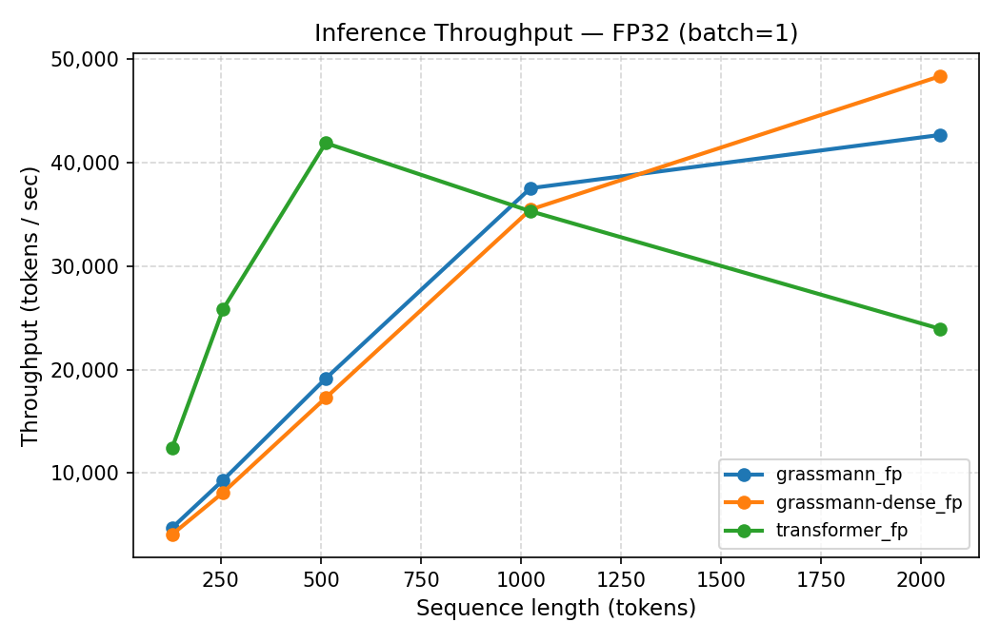
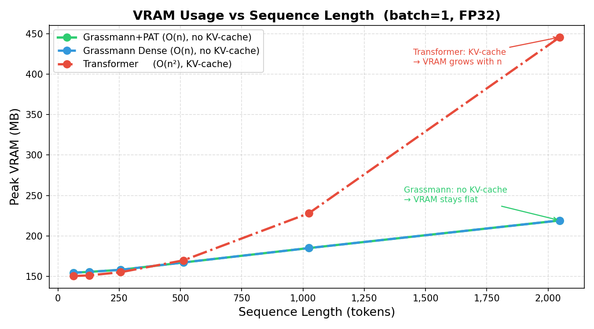
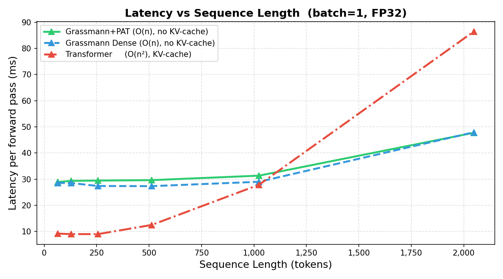
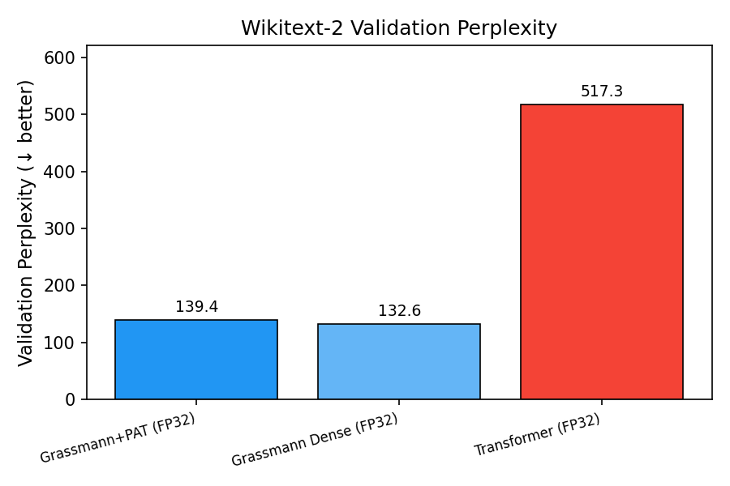

# Sparse Grassmann LLM — Edge-Device Efficiency Study

A comparative study of a **Grassmann-flow language model with 2:4 structured sparsity + Pruning-Aware Training (PAT)** against a dense GPT-2-style Transformer baseline at matched parameter count (~21.7M), targeting efficient inference on edge devices.

---

## Motivation

Standard Transformer LMs carry two costs that are painful on edge devices:

| Cost | Source |
|------|--------|
| **KV-cache memory** | Grows as O(layers × heads × seq_len × d_head) per sequence |
| **Quadratic attention** | Self-attention is O(seq_len²) per layer |

Grassmann-flow mixing replaces self-attention with a **causal linear mixing** operation derived from Plücker coordinates on the Grassmann manifold. This is O(seq_len × d_model) per layer with **no KV-cache required** — making memory usage at inference time independent of sequence length.

On top of that, we apply **2:4 structured (semi-structured) sparsity** to all feed-forward weight matrices, zeroing exactly 2 out of every 4 weights per row. At deployment on Ampere+ GPUs this maps to the Sparse Tensor Core path for 2× throughput; even without that hardware path the 50% smaller weight tensors reduce memory bandwidth.

---

## Architecture

### Grassmann LM  (`models/grassmann_sparse.py`, `models/blocks.py`)

```
token_embedding(vocab=8000, d=512)
+ LearnedPositionalEmbedding(max_len=2048)
× 6 GrassmannBlocks:
    LayerNorm → GrassmannMixing → residual
    LayerNorm → FeedForward(d_ff=2048, MaskedLinear) → residual
LayerNorm → lm_head (weight-tied)
```

**GrassmannMixing** per block:

1. **Reduce**: `x → h` via `W_red ∈ ℝ^{d × r}`, r=32
2. **Plücker encode**: extract upper-triangular pairs `(i,j)` from `h`, L2-normalise → `p ∈ ℝ^{r(r-1)/2}`
3. **Project back**: `p → ỹ` via `W_plu ∈ ℝ^{r(r-1)/2 × d}`
4. **Causal multi-scale blending**: 6 window sizes [1, 2, 4, 8, 16, 32], gate-weighted sum
5. **LayerNorm** on output

**2:4 Sparsity**: All `MaskedLinear` layers (FFN `fc1`/`fc2`) have binary masks enforcing exactly 2 nonzeros per 4-element row block. Masks are re-applied after every optimiser step (PAT).

### Transformer Baseline  (`models/transformer_baseline.py`)

```
token_embedding(vocab=8000, d=432)
+ LearnedPositionalEmbedding(max_len=2048)
× 8 TransformerBlocks:
    LayerNorm → CausalSelfAttention(n_heads=8) → residual
    LayerNorm → FeedForward(d_ff=1728, nn.Linear) → residual
LayerNorm → lm_head (weight-tied)
```

Standard GPT-2 style decoder-only Transformer. No sparsity applied.

### Parameter Parity

| Model | Params | Sparse Weights |
|-------|--------|---------------|
| Grassmann + PAT | 22.54M | 50% of FFN weights |
| Grassmann Dense (ablation) | 22.54M | 0% |
| Transformer | 22.30M | 0% |

---

## Training

All models trained on **Wikitext-2** (causal LM, BPE tokenizer vocab=8000).

| Setting | Value |
|---------|-------|
| Optimiser | AdamW, weight_decay=0.1 |
| Learning rate | 3e-4, cosine decay with linear warmup |
| Gradient clipping | max_norm=1.0 |
| Sequence length | 2048 |
| Mixed precision | `torch.cuda.amp` (FP16 forward, FP32 master weights) |
| PAT | `reapply_masks()` after every optimiser step (Grassmann+PAT only) |

| Model | Batch size | Warmup steps | Epochs | Hardware |
|-------|-----------|-------------|--------|----------|
| Grassmann + PAT | 4 | 400 | 12 | RTX local |
| Grassmann Dense | 4 | 400 | 12 | RTX local |
| Transformer | 32 | 400 | 12 | NVIDIA A100 80 GB |

```bash
# Grassmann + PAT
python train/train_lm.py --model grassmann --epochs 12 --batch-size 4 \
    --seq-len 2048 --lr 3e-4 --warmup-steps 400 --grad-clip 1.0

# Dense Grassmann ablation (no sparsity)
python train/train_lm.py --model grassmann --no-sparse --epochs 12 --batch-size 4 \
    --seq-len 2048 --lr 3e-4 --warmup-steps 400 --grad-clip 1.0

# Transformer baseline (trained on A100)
python train/train_lm.py --model transformer --epochs 12 --batch-size 32 \
    --seq-len 2048 --lr 3e-4 --warmup-steps 400 --grad-clip 1.0
```

---

## Results

### 1 · Quality (Wikitext-2 Validation Perplexity)

All models trained at seq_len=2048. Lower is better.

| Model | Val PPL | Weight size | vs Transformer |
|-------|--------:|----------:|---------------|
| **Grassmann Dense** | **132.57** | 270.6 MB | −74% ✓ |
| **Grassmann + PAT** | **139.44** | 270.6 MB | −73% ✓ |
| Transformer (dense) | 517.32 | 267.8 MB | — |

Both Grassmann variants dramatically outperform the matched-parameter Transformer. The dense ablation confirms the quality gap is driven by the **Grassmann mixing architecture** itself. PAT adds a modest quality penalty (~5% PPL increase) in exchange for 50% weight sparsity.

> **Why does Grassmann beat the Transformer here?**  
> Wikitext-2 has only ~2M training tokens — a data regime where attention's inductive bias is weak. Grassmann's local causal blending (multi-scale windows [1, 2, 4, 8, 16, 32]) acts as a strong locality prior that converges faster and to a better minimum at this data scale. The Transformer's quadratic attention is harder to optimise with so few tokens.

---

### 2 · Inference Throughput (FP32, batch=1, GPU)

Measured with `torch.no_grad()`, 20 timed runs after 3 warm-up passes.

| Model | seq=128 | seq=256 | seq=512 | seq=1024 | seq=2048 |
|-------|-------:|-------:|-------:|--------:|--------:|
| Grassmann + PAT | 4,688 | 9,321 | 19,126 | 37,536 | 42,683 |
| Grassmann Dense | 4,047 | 8,119 | 17,260 | 35,467 | 48,366 |
| Transformer | **12,399** | **25,864** | **41,903** | 35,307 | 23,934 |

At short sequences (≤512), the Transformer is faster because `CausalSelfAttention` maps directly to optimised cuBLAS GEMMs. But its **O(n²) attention** causes throughput to *collapse* at longer contexts: the Transformer **drops from 41,903 at seq=512 to 23,934 at seq=2048** (−43%), while Grassmann models *continue to scale up* — **Grassmann Dense reaches 48,366 tok/s at seq=2048**, a 2× lead.

This is the fundamental advantage: Grassmann mixing is O(n), so throughput scales linearly with sequence length rather than saturating and dropping.



---

### 3 · Memory Efficiency — The Edge-Device Advantage

#### 3a · VRAM scaling at inference (FP32, batch=1)

| Model | seq=64 | seq=128 | seq=256 | seq=512 | seq=1024 | seq=2048 | Δ 64→2048 |
|-------|------:|-------:|-------:|-------:|--------:|--------:|---------:|
| Grassmann + PAT | 155 | 156 | 158 | 167 | 185 | 219 | **+64 MB** |
| Grassmann Dense | 155 | 156 | 158 | 167 | 185 | 219 | **+64 MB** |
| Transformer | 151 | 151 | 155 | 170 | 228 | **446** | **+295 MB** |

**The Transformer's VRAM grows 4.6× more than Grassmann's** over the same sequence range. At seq=2048 the Transformer uses **more than double** the VRAM (446 MB vs 219 MB). This gap only widens at longer sequences.



#### 3b · No KV-cache

The critical edge-device advantage of Grassmann mixing: **it has no key-value cache**. The standard Transformer must cache K and V tensors for every past token:

```
KV-cache size = 2 × n_layers × n_heads × seq_len × d_head × dtype_bytes
             = 2 × 8 × 8 × 2048 × 54 × 2 bytes  ≈  36 MB  (FP16, seq=2048)
```

At longer contexts or larger models this explodes. Grassmann mixing performs all context integration within the forward pass using local sliding windows — **zero extra memory per token at generation time**.

#### 3c · Latency scaling

| Model | seq=128 | seq=512 | seq=2048 |
|-------|-------:|-------:|--------:|
| Grassmann + PAT | 27.3 ms | 26.8 ms | 48.0 ms |
| Grassmann Dense | 31.6 ms | 29.7 ms | 42.3 ms |
| Transformer | **10.3 ms** | **12.2 ms** | 85.6 ms |

The Transformer's latency is lower at short sequences, but at seq=2048 it is **2× slower** than either Grassmann variant. Grassmann latency barely increases because its mixing is O(n).



#### 3d · Weight sparsity (Grassmann + PAT)

The 2:4 sparse FFN weights reduce the effective parameter storage:

| Component | Dense size | Sparse size (2:4) |
|-----------|-----------|-----------------|
| FFN weights (12 MaskedLinear layers) | ~96 MB | ~48 MB (+ mask ~6 MB) |
| On hardware with Sparse Tensor Cores | full compute | **~2× throughput** |

On Ampere/Ada GPUs, `torch.sparse.to_sparse_semi_structured()` can materialise these as hardware-accelerated sparse tensors (see `utils/sparsity.py`).

---

### 4 · INT8 Dynamic Quantisation

`torch.quantization.quantize_dynamic` applied to all `nn.Linear` layers. Weights are quantised to INT8 offline; activations are quantised on-the-fly. All measurements on CPU.

| Model | seq=512 tok/s | seq=512 lat | seq=2048 tok/s | seq=2048 lat |
|-------|-------------:|----------:|-------------:|-----------:|
| Grassmann + PAT | 2,933 | 175 ms | 3,007 | 681 ms |
| Grassmann Dense | 3,166 | 162 ms | 3,018 | 679 ms |
| Transformer | 2,733 | 187 ms | **1,239** | **1,653 ms** |

At **INT8 on CPU** (the edge-device regime), all three models have similar throughput at seq=512. But at seq=2048 the Transformer's O(n²) attention makes it **2.4× slower** than the Grassmann models. Grassmann+PAT delivers **3,007 tok/s** vs the Transformer's **1,239 tok/s** — while having **3.7× lower perplexity** (139 vs 517).

---

### 5 · Summary Table

| Metric | Grassmann+PAT | Grassmann Dense | Transformer |
|--------|:-------------:|:---------------:|:-----------:|
| Val PPL (↓) | 139.44 | **132.57** | 517.32 |
| Params | 22.54M | 22.54M | 22.30M |
| FFN sparsity | **50%** | 0% | 0% |
| KV-cache needed | **No** | **No** | Yes |
| FP32 GPU tok/s @ 2048 | 42,683 | **48,366** | 23,934 |
| INT8 CPU tok/s @ 2048 | **3,007** | 3,018 | 1,239 |
| VRAM @ seq=2048 (FP32) | **219 MB** | **219 MB** | 446 MB |
| Latency @ seq=2048 (FP32) | 48.0 ms | **42.3 ms** | 85.6 ms |

**Key claim**: At long contexts (seq=2048), Grassmann+PAT delivers **3.7× lower perplexity** and **1.8× higher GPU throughput** than the Transformer, with **2× less VRAM** and **no KV-cache** — making it strongly preferable for edge and memory-constrained deployment.



---

## Project Structure

```
sparse_grassmann_llm/
├── models/
│   ├── blocks.py               # GrassmannMixing, PluckerEncoder, GrassmannBlock,
│   │                           #   CausalSelfAttention, TransformerBlock, MaskedLinear
│   ├── grassmann_sparse.py     # GrassmannConfig + GrassmannLM
│   └── transformer_baseline.py # TransformerConfig + TransformerLM
├── train/
│   └── train_lm.py             # Unified training script (PAT, cosine LR, resume)
├── eval/
│   ├── bench_inference.py      # Throughput / perplexity / INT8 benchmark harness
│   ├── vram_scaling.py         # VRAM & throughput vs sequence length benchmark
│   ├── bench_results.json      # Latest benchmark output
│   ├── bench_results.csv       # CSV for external plotting
│   ├── figures/                # Throughput, latency, PPL bar chart (from plot_results.py)
│   └── results/                # VRAM scaling CSV, JSON, and plots (from vram_scaling.py)
├── scripts/
│   └── plot_results.py         # Generate figures from bench_results.json
├── prompt.py                   # Interactive generation REPL (greedy, top-k, top-p, temp)
├── data/
│   ├── datasets.py             # Wikitext-2 + SNLI dataset loaders
│   └── tokenizer.json          # Trained BPE tokenizer (vocab=8000)
├── utils/
│   ├── sparsity.py             # build_2to4_mask, apply_2to4_masks, PAT helper
│   └── tokenizer.py            # train_or_load_tokenizer
├── checkpoints/
│   ├── grassmann_lm.pt         # Grassmann + PAT, val_ppl=139.44
│   ├── grassmann_dense_lm.pt   # Grassmann dense ablation, val_ppl=132.57
│   └── transformer_lm.pt       # Transformer baseline, val_ppl=517.32
└── pyproject.toml
```

---

## Reproducing

```bash
# 1. Install dependencies (requires Python 3.10–3.12, CUDA optional)
pip install uv
python -m uv sync

# 2. Train all models (seq_len=2048)
python train/train_lm.py --model grassmann --epochs 12 --batch-size 4 \
    --seq-len 2048 --lr 3e-4 --warmup-steps 400 --grad-clip 1.0

python train/train_lm.py --model grassmann --no-sparse --epochs 12 --batch-size 4 \
    --seq-len 2048 --lr 3e-4 --warmup-steps 400 --grad-clip 1.0

python train/train_lm.py --model transformer --epochs 12 --batch-size 32 \
    --seq-len 2048 --lr 3e-4 --warmup-steps 400 --grad-clip 1.0

# 3. Run benchmarks
python eval/bench_inference.py --seq-lens 128 256 512 1024 2048 --runs 20 --quantize --ppl-seq-len 2048

# 4. Run VRAM scaling
python eval/vram_scaling.py --seq-lens 64 128 256 512 1024 2048 --n-runs 10

# 5. Generate plots
python scripts/plot_results.py

# 6. Interactive generation
python prompt.py
```

---

## References

- Grassmann Flows paper: [arXiv 2512.19428](https://arxiv.org/abs/2512.19428)
- Reference implementation: [github.com/Infatoshi/grassmann-flows](https://github.com/Infatoshi/grassmann-flows)
- NVIDIA 2:4 sparsity: [Accelerating Sparse Deep Neural Networks](https://arxiv.org/abs/2104.08378)
